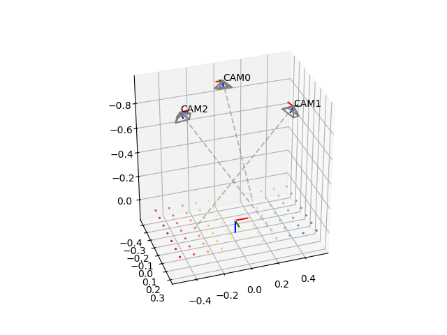
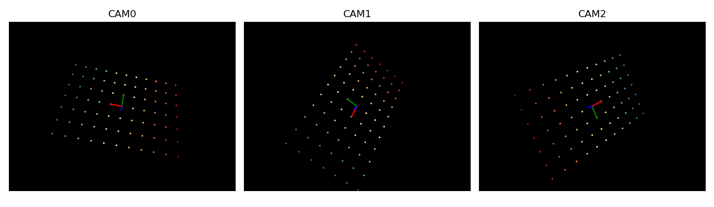

# multicam-pose

Multi-camera pose estimation using the method of Lee *et al.* [^Lee2015].

# Introduction

The Perspenctive-n-Point problem (PnP), i.e., the problem of estimating a camera pose from $n$ world-to-image point correspondences, is one of the fundamental problems of  geometric computer vision. The body of publications on PnP is significant; the variant with $n = 3$, called P3P, alone has at least several documented solutions. The applications of PnP/P3P are vast and include visual odometry, camera calibration, and photogrammetry.

Intrinsically, the PnP/P3P algorithms work with a single camera. Most applications, however, require localizing an entire camera rig. Naturally, one may run standard PnP pose estimation for each camera, typically in combination with with some RANSAC-like outlier rejection scheme, and choose a solution that best fits all of the cameras in a rig. This is where multi-camera pose estimation algorithms come handy. This project implements one such algorithm, namely, the method by Lee *et al.* proposed in the following paper:

```
@article{Lee2015,
    author = {Gim Hee Lee and Bo Li and Marc Pollefeys and Friedrich Fraundorfer},
    title ={Minimal solutions for the multi-camera pose estimation problem},
    journal = {The International Journal of Robotics Research},
    volume = {34},
    number = {7},
    pages = {837-848},
    year = {2015},
    doi = {10.1177/0278364914557969},
    URL = {https://doi.org/10.1177/0278364914557969}
}
```

# Solution

The algorithm accepts a set of 3 world points $\{X_1, X_2, X_3\}$, the corresponding image observations $\{x_1, x_2, x_3\}$, as well as intrinsics (specifically, pinhole matrices) and extrinsics of the cameras that observed these points. Without loss of generality, assume there are 3 distinct cameras.
Camera rays are represented using Pl&uuml;cker lines and the reference points are parameterized by depths along the Pl&uuml;cker lines.

The solution is based on the observation that pair-wise distances between the three points are the same in both the world and rig coordinate frames, which leads to the following constraint between each pair of points $(X_i, X_j)$:
$$
\begin{equation*}
\lVert X_i - X_j \rVert^2 = \lVert \lambda_i d_i + \lambda_j d_j - (\underbrace{d_i \times m_i + d_j \times m_j}_{c_{ij}})  \rVert^2
\end{equation*}
$$
where $\lambda_i$ and $\lambda_j$ are the depths along the Pl&uuml;cker lines.

By expanding the RHS, evaluating multiplication, and grouping terms the above is rewritten as
$$
k_1\lambda_i^2 + (k_2\lambda_j + k_3)\lambda_i + k_4\lambda_j^2 + k_5\lambda_j + k_6 = 0 \, ,
$$
where
$$
\begin{align*}
% c_{ij} &= d_i \times m_i - d_j \times m_j \\
k_1 &= d_i^T d_i \\
k_2 &= -2 d_i^T d_j \\
k_3 &= 2 d_i^T c_{ij} \\
k_4 &= d_j^T d_j \\
k_5 &= -2 d_j^T c_{ij} \\
k_6 &= c_{ij}^T c_{ij} - \lVert X_i - X_j \rVert^2 \, .
\end{align*}
$$

Combined, the three constraints yield a system of polynomial equations 
$$
\begin{align*}
k_{11}\lambda_1^2 + (k_{12}\lambda_2 + k_{13})\lambda_1 + k_{14}\lambda_2^2 + k_{15}\lambda_2 + k_{16} &= 0 \\
k_{21}\lambda_1^2 + (k_{22}\lambda_3 + k_{23})\lambda_1 + k_{24}\lambda_3^2 + k_{25}\lambda_3 + k_{26} &= 0 \\
k_{31}\lambda_2^2 + (k_{32}\lambda_3 + k_{33})\lambda_2 + k_{34}\lambda_3^2 + k_{35}\lambda_3 + k_{36} &= 0
\end{align*} \, ,
$$

which is solved by applying the Sylvester resultant method twice. The first application eliminates $\lambda_1$ from the first two equations, the second consumes the result of the first application and eliminates $\lambda_2$ from the third equation. This double elimination yields a degree 8 polynomial  
$$
A\lambda_3^8 + B\lambda_3^7 + C\lambda_3^6 + D\lambda_3^5 + E\lambda_3^4 + F\lambda_3^3 + G\lambda_3^2 + H\lambda_3^5 + I = 0 \, ,
$$
where $A, B, \ldots, I$ are algebraic expressions composed of the coefficients of the original system. 
After finding the roots of the above polynomial (solutions for $\lambda_3$), the values of $\lambda_2$ and $\lambda_1$ are calculated using the remaining equations through back-substitution. Up to 32 solutions are found, of which imaginary solutions or negative depths (points behind cameras) can be discarded. 

# Example

To demonstrate the implementation, a synthetic rig is used with 3 identical cameras mapping 90 x 67.5 deg. viewing volumes into 1440 x 1080px image spaces. The cameras observe a planar grid of points ("world points"), e.g., corners in a checkerboard pattern such as those used in camera calibration, of which three are chosen as reference points for pose estimation. The origin of the coordinate world coordinate system is in the center of the grid and x- and y-axes run along the rows and columns of points. Additionally, small Gaussian noise is added to all observations. The experimental setup is illustarted below.



The implementation takes three camera centers, three unit-length vectors in rig coordinate frame representing the corresponding camera rays, and the three reference world points. This removes the dependency on pinhole matrices or camera models in general, allowing the core pose estimation routine to work with arbitrary cameras as long as their projection/unprojection functions are known.   

The crux of the algorithm is evaluating the coefficients of the univariate polynomial dependent on $\lambda_3$; the paper omits the details of this operation. Here, the expressions for $A, B, \ldots, I$ were obtained using Macaulay2[^Macaulay2] (see comments in `solver.py` for specific commands). 

Once candidate poses are calculated and the best-fititng pose is identified, it is refined using non-linear least squares (`scipy.optimize.least_squares`) by minimizing the total reprojection error over all observations; rotations are parameterized in $SO(3)$ with `scipy.spatial.transform.Roation` providing the exponential map and logarithm operations:

```
     message: `gtol` termination condition is satisfied.
     success: True
      status: 1
         fun: [-8.569e-07 -1.773e-07 ... -8.984e-07 -6.842e-07]
           x: [ 9.716e-02 -5.654e-01 -2.923e+00 -1.073e-10  5.257e-10
                1.000e+00]
        cost: 1.3266811320582312e-10
         jac: [[ 1.019e+02  1.402e+02 ...  0.000e+00  3.952e+02]
               [ 1.473e+02  6.839e+01 ... -3.116e+02  5.288e+02]
               ...
               [-9.093e+01  8.179e+01 ... -3.304e+02  2.472e+02]
               [ 7.538e+01 -4.908e+01 ...  4.901e+02 -2.802e+02]]
        grad: [ 2.572e-09 -6.126e-10 -6.329e-10 -5.712e-10  2.000e-09
                8.926e-09]
  optimality: 8.926367486969053e-09
 active_mask: [ 0.000e+00  0.000e+00  0.000e+00  0.000e+00  0.000e+00
                0.000e+00]
        nfev: 3
        njev: 3
```

Geometric accuracy of the refined pose is quantified by average reprojection error and rotational/positional differences between the pose estimate and ground truth.

```
   initial error: 0.581514px
     final error: 0.307648px
 rotational diff: 0.382448mrad
 positional diff: 0.000031m
```

Finally, synthetic views of the test points in the view of the 3 cameras are generated and primary axes of the world's coordinate system are "rendered" into the views using the refined pose estimate to visualize the solution. 




[^Lee2015]: "Minimal Solutions for Pose Estimation of a Multi-Camera System", Gim Hee Lee, Bo Li, Marc Pollefeys, and Friedrich Fraundorfer (2015) <https://doi.org/10.1177/0278364914557969>.


[^Macaulay2] [Macaulay2](https://macaulay2.com>). A software system devoted to supporting research in algebraic geometry and commutative algebra